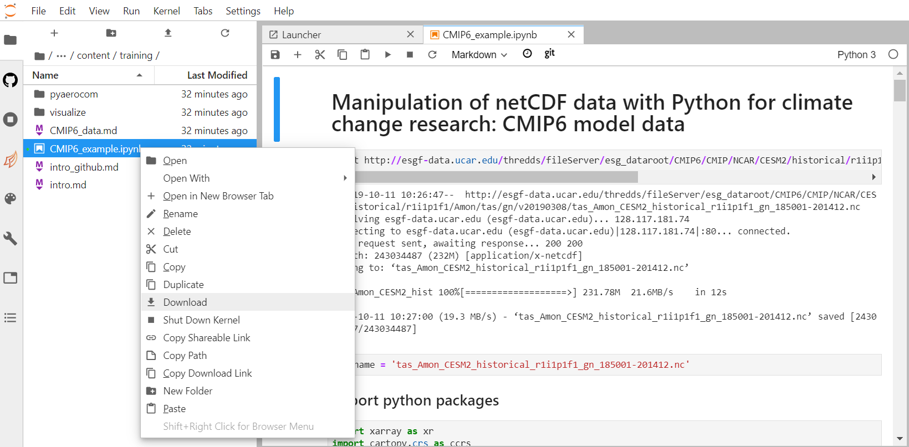
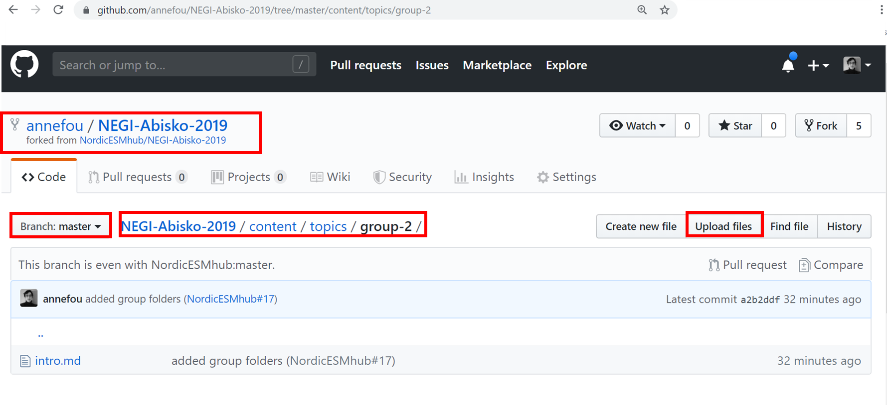
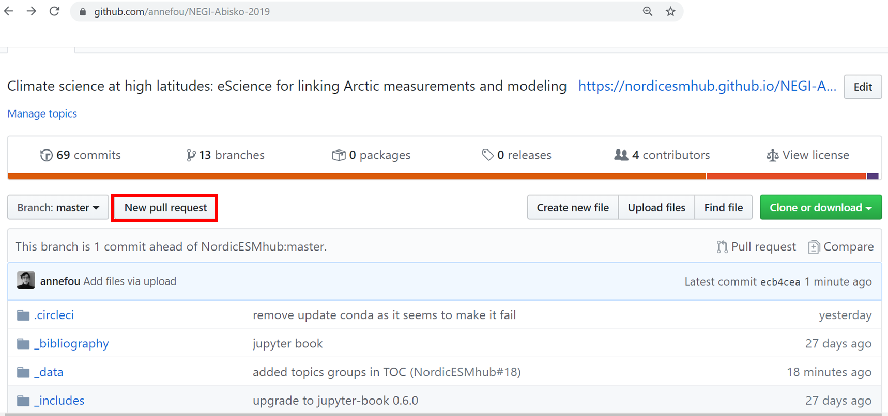
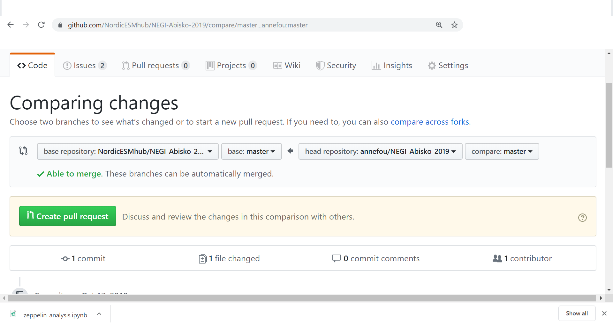
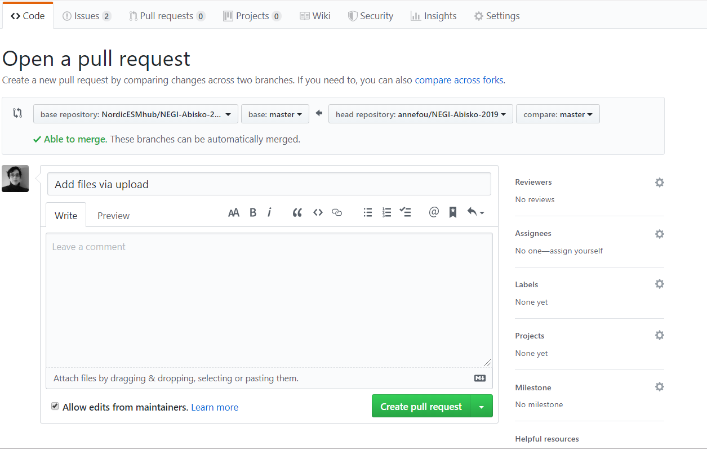

# Make your very first contributions

Welcome to the `NEGI-Abisko-2019` repository! We're excited you're here and want to contribute.

Before you start you'll need to set up a free [GitHub][link_github] account and sign in.
Here are some [instructions][link_signupinstructions].

# Give us feedback

One overy valuable contribution you can make is to give us feedback so we can improve `NEGI-Abisko-2019`!

Let us know what you think about `NEGI-Abisko-2019` [here][link_issues]!

[link_issues]: https://github.com/NordicESMHub/NEGI-Abisko-2019/issues

# Upload a jupyter notebook

Let's say you have written a Jupyter notebook and would like to share it. 

There are several ways to do it and in this section we will show you how to add it manually. Later, we will teach you on how to streamline your work and add your notebooks with `git`.

### Step-1: download your jupyter notebook on your local computer

In the file browser of [NEGI Abisko Jupyerthub](https://abisko.uiogeo-apps.sigma2.no), right click on the jupyter notebook you wish to share and download it shown on the figure below:

The downloaded jupyter notebook is located in your *Downloads* folder.

### Step-2: upload your jupyter notebook to Github

In your web browser:

- Go to [https://github.com/NordicESMhub/NEGI-Abisko-2019](https://github.com/NordicESMhub/NEGI-Abisko-2019)
- Click on *fork* as shown on the image below

- Then go to your fork in your browser. The web address of your fork should be something like **https://github.com/USERNAME/NEGI-Abisko-2019** where **USERNAME** needs to be replaced by your github username.
- **In your fork**, make sure the `master` branch is selected 
- Browse to *content* --> *topics* and select your group folder

In the figure above, parts in red highlight what you need to check before uploading your jupyter notebook.

- Then click on `upload files` and `choose your files` to select the jupyter notebook you wish to share (see image below)

- Write a short message (in the Commit changes section) and click on the green **Commit changes** button.

- Finally in your fork repository, find the **New pull request** button and click on it to create a new pull request.

- Create a pull request

And then:

**You are done!**

Now your pull request will be reviewed and your contribution included in NEGI-Abisko-2019.

Well done!!!

