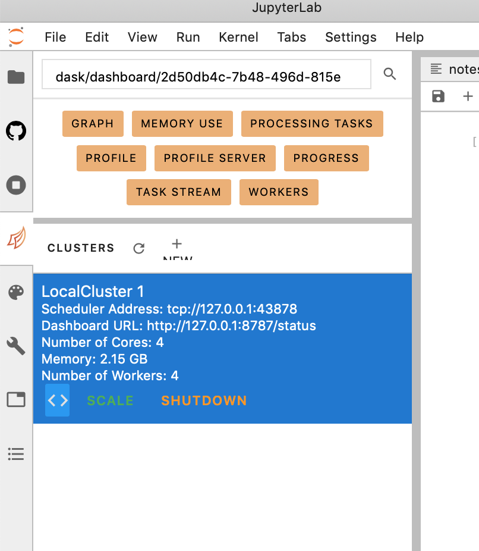
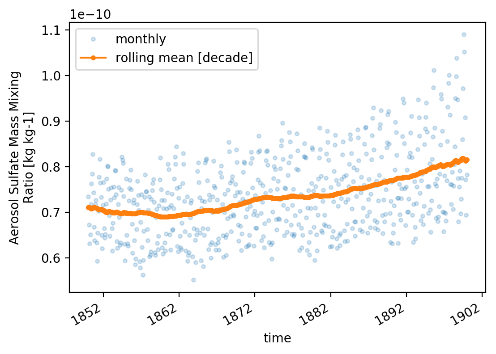

go to the dask array tab (shown below) and click on '<>'


```python
from IPython.display import Image
Image(filename='dask.png',width=400)
```





something similar to the cell below should have being incerted


```python
from dask.distributed import Client

client = Client("tcp://127.0.0.1:46013")
client
```


<table style="border: 2px solid white;">
<tr>
<td style="vertical-align: top; border: 0px solid white">
<h3 style="text-align: left;">Client</h3>
<ul style="text-align: left; list-style: none; margin: 0; padding: 0;">
  <li><b>Scheduler: </b>tcp://127.0.0.1:46013</li>
  <li><b>Dashboard: </b><a href='http://127.0.0.1:8787/status' target='_blank'>http://127.0.0.1:8787/status</a>
</ul>
</td>
<td style="vertical-align: top; border: 0px solid white">
<h3 style="text-align: left;">Cluster</h3>
<ul style="text-align: left; list-style:none; margin: 0; padding: 0;">
  <li><b>Workers: </b>4</li>
  <li><b>Cores: </b>4</li>
  <li><b>Memory: </b>2.15 GB</li>
</ul>
</td>
</tr>
</table>


```python
from negi_stuff.modules.imps import *
from pathlib import Path
```


    <div class="bk-root">
        <a href="https://bokeh.pydata.org" target="_blank" class="bk-logo bk-logo-small bk-logo-notebook"></a>
        <span id="1001">Loading BokehJS ...</span>
    </div>


```python
df = cmip6.search_cmip6_hist(wildcard='mmrso4*',model='CESM*')
```


```python
_ds = df.sort_values(['FORCING','REALIZATION'],ascending=[False,True])
```


```python
_ds = df.sort_values(
    by       = [cmip6.FF,cmip6.RR,cmip6.FF],
    ascending= [False   ,True    ,True]
              )
```


```python
_dg = _ds.groupby(cmip6.MODEL).first()
```


```python
SIZE = 'SIZE'
df[SIZE] = df[cmip6.FILES].apply(lambda f: os.path.getsize(f))
```


```python
_r = df.sort_values(SIZE, ascending=False).iloc[20]
```


```python
_r['FILE_PATH']
```


    '/home/28f6ea40-2d3059-2d4f6b-2d8429-2deb8e956423db/shared-cmip6-for-ns1000k/historical/CESM2/r11i1p1f1/mmrso4_AERmon_CESM2_historical_r11i1p1f1_gn_185001-189912.nc'


```python
large_file = '/home/28f6ea40-2d3059-2d4f6b-2d8429-2deb8e956423db/shared-cmip6-for-ns1000k/historical/CESM2/r11i1p1f1/mmrso4_AERmon_CESM2_historical_r11i1p1f1_gn_185001-189912.nc'
```

lets explore the dataset. 
however this is not opening the dataset as a 
[dask array] (https://examples.dask.org/xarray.html)


```python
ds = xr.open_dataset(large_file)
```

    /opt/conda/lib/python3.7/site-packages/xarray/conventions.py:494: SerializationWarning: variable 'mmrso4' has multiple fill values {1e+20, 1e+20}, decoding all values to NaN.
      use_cftime=use_cftime,


```python
#lets check the dimensions
ds.dims
```


    Frozen(SortedKeysDict({'time': 600, 'lev': 32, 'lat': 192, 'lon': 288, 'nbnd': 2}))


```python
#this will load the dataset as a dask array and therefore it will not kill the kernel
#some understanding of which operations you will perform on the dataset are needed
#in this case we are slicing the dataset along time in chunks of 1.
ds = xr.open_dataset(large_file,chunks={'time':1})
```


```python
var = 'mmrso4'
```


```python
# this will run fast but its just bc it hasn't been evaluated yet. 
# so, daks will store the operations that you want on the dataset and only compute them 
# when its necessary (e.g. when you want to plot the results). You can force the computation by 
# calling .load() (see the next cell)
ds[var].mean()
```


    <xarray.DataArray 'mmrso4' ()>
    dask.array<mean_agg-aggregate, shape=(), dtype=float32, chunksize=(), chunktype=numpy.ndarray>


```python
# in order to get the actual value you need to load
```


```python
# ds[var][{'time':slice(0,None)}].mean().load()
```


    <xarray.DataArray 'mmrso4' ()>
    array(7.359101e-11, dtype=float32)


```python
#convert cftime to datetime64
_c1 = ds['time'][0].item()
ds['time'] = pd.to_datetime(ds['time'].dt.strftime(_c1.format))
```


```python
da1 = ds[var].groupby('time').mean(xr.ALL_DIMS).load()
da1 = da1.assign_attrs(ds[var].attrs)
```


```python
da_rolling_mean = da1.rolling({'time':12*10},min_periods=1,center=True).mean()
da_rolling_mean = da_rolling_mean.assign_attrs(ds[var].attrs)
```


```python
def _plot():
    ax = plt.axes()
    l1 = 'monthly'
    l2 = f'rolling mean [decade]'
    da1.            plot(marker='.',linestyle='None', alpha=.2, label =l1, ax=ax )
    da_rolling_mean.plot(marker='.',linestyle='-'   , alpha=1 , label =l2, ax=ax )

    ax.legend();
```


```python
_plot()
```





```python
# increace res
mpl.rcParams['figure.dpi'] = 200
_plot()
```


```python
!git add ./*
```


```python
!git commit -m'dask example'
```

    [master 34dfbe9] dask example
     3 files changed, 883 insertions(+)
     create mode 100644 content/training/dask_kernel/dask_kernel.ipynb
     create mode 100644 content/training/dask_kernel/dask_kernel.py
     create mode 100644 content/training/dask_kernel/images/dask.png


```python
!git pull
```

    error: You have not concluded your merge (MERGE_HEAD exists).
    hint: Please, commit your changes before merging.
    fatal: Exiting because of unfinished merge.


```python

```
